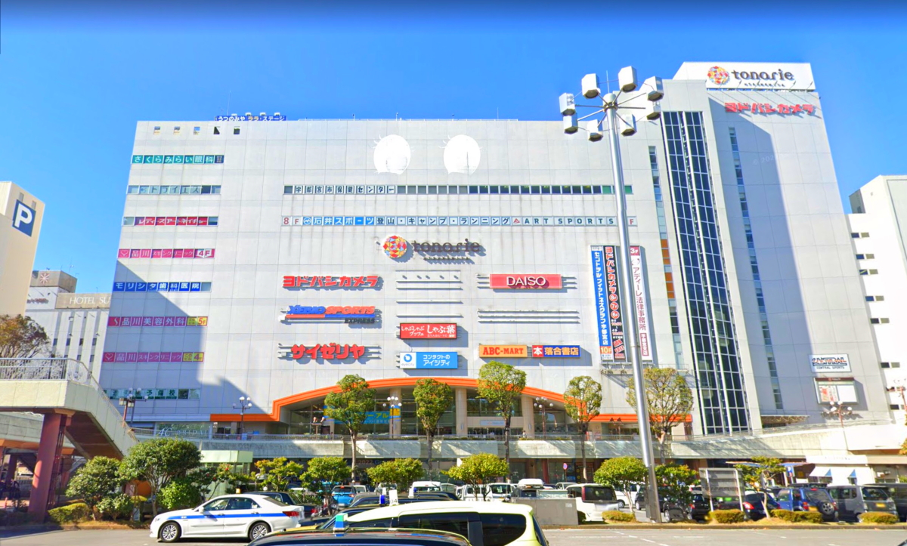
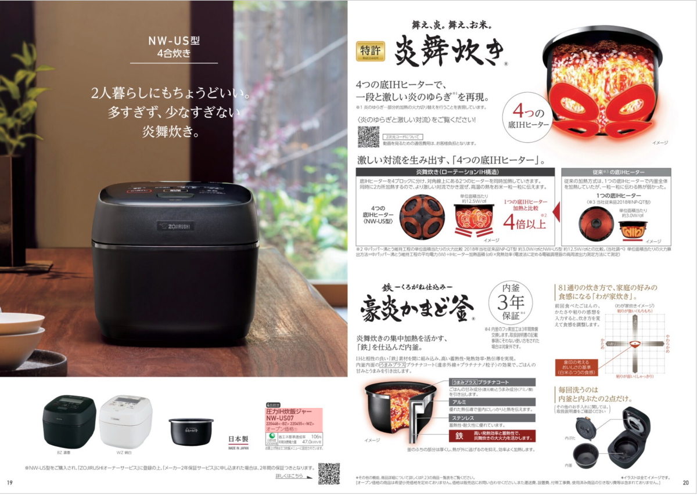
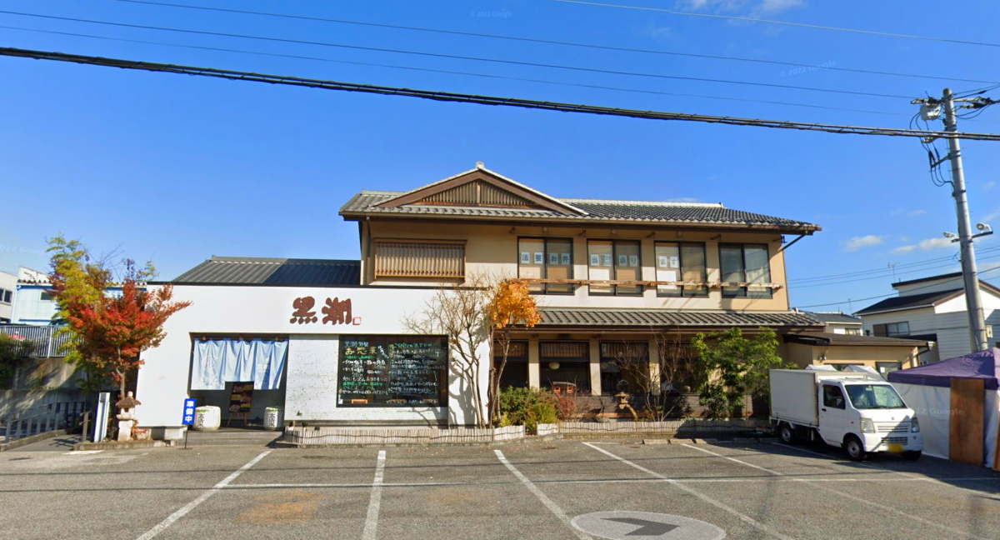
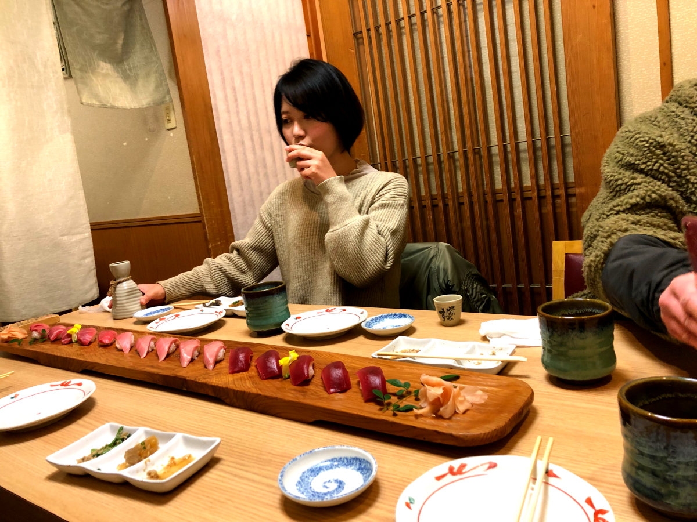
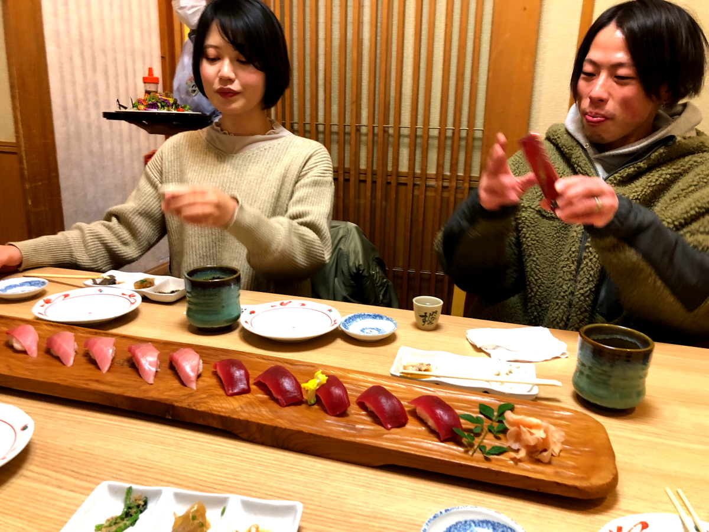
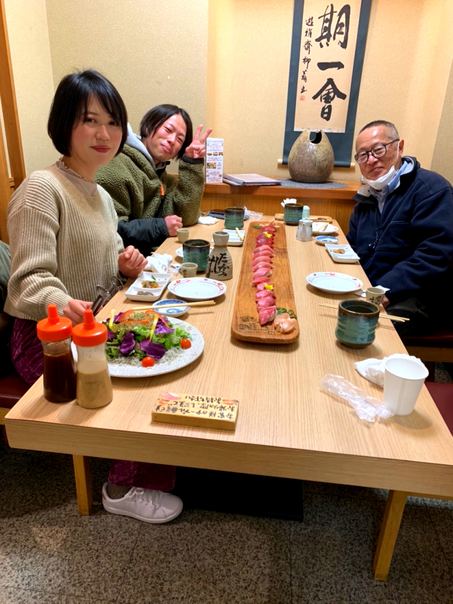

# wedding-present

<html lang="ja">
 <head>
  <meta charset="utf-8" />
	 

<link href="https://cdnjs.cloudflare.com/ajax/libs/lightbox2/2.7.1/css/lightbox.css" rel="stylesheet">
 
</head>
<body>

  モバイル端末をお使いの場合は、画面を横向きにすると
  より見やすくご覧頂けます。

<a href="https://torokoid.github.io/fts_home">Home</a>><a href="https://torokoid.github.io/fts">wedding-present</a>

<h1><marquee behavior="alternate">!!! 2022年12月27日(火)結婚のプレゼントに炊飯器!!!</marquee></h1>

                            
	

結婚プレゼントは、ヨドバシカメラで購入

プレゼントの炊飯器は、かなりの逸品！

帰り道の「黒潮すし」で晩御飯

    

  
	
	
	
	

                                       

  

 

<!-- フッタ -->
 <footer>
 
Copyright 2022/12/27 S.Hada

 </footer>
